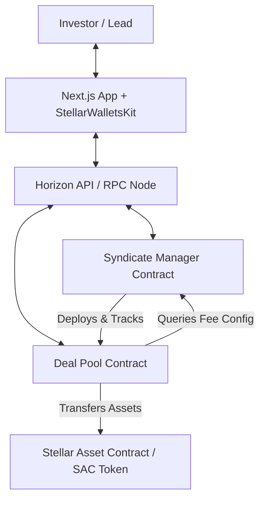
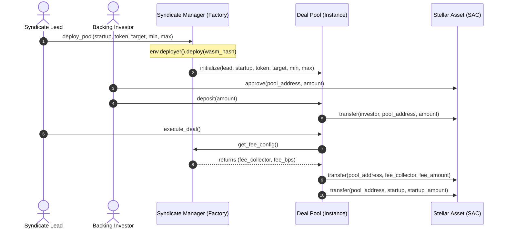

# EquiRise - Startup Investment Syndicate Platform

EquiRise is a decentralized startup investment syndicate platform built on Stellar. It empowers lead investors to securely spin up deal pools via Soroban smart contracts, pool capital from backed community investors, automate cap table management, and transparently distribute returns.

---

## Architecture & System Design

### Platform Components



### Inter-Contract Communication Flow



---

## Smart Contract Design

EquiRise utilizes two core smart contracts compiled to WebAssembly and deployed on Stellar's Soroban VM:

1. **Syndicate Manager (Factory & RBAC)**
   - Deploys new Deal Pool instances dynamically.
   - Restricts deal creation to verified lead investors via Role-Based Access Control (RBAC).
   - Manages global platforms fees, collector addresses, and contract upgrade mappings.

2. **Deal Pool**
   - Stores specific configuration parameters (Lead, Startup Address, Target Capital Goal, Investment Bounds).
   - Manages the capital pooling phases: `Active` -> `Funded` / `Closed` -> `Distributed`.
   - Distributes proportional ROI returns dynamically back to syndicate investors (pro-rata distribution).

---

## Tech Stack & Features

- **Frontend Core**: Next.js 15, React 19, TypeScript, Tailwind CSS, Lucide icons.
- **State & Queries**: Zustand (client states), React Query (blockchain RPC sync).
- **Stellar Kit**: `@creit.tech/stellar-wallets-kit` (Freighter / multi-wallet connection).
- **Contracts**: Rust, Soroban SDK (v22.0.1).
- **Testing Suite**: Vitest, React Testing Library (frontend), cargo test (contracts).
- **CI/CD**: GitHub Actions workflows.

---

## Environment Variables

Copy `.env.example` to create your local environments:

```bash
cp .env.example .env
```

| Name | Description | Default |
| :--- | :--- | :--- |
| `NEXT_PUBLIC_STELLAR_NETWORK` | Target network type | `testnet` |
| `NEXT_PUBLIC_RPC_URL` | Stellar RPC endpoint | `https://soroban-testnet.stellar.org` |
| `NEXT_PUBLIC_EXPLORER_URL` | Transaction explorer URL | `https://stellar.expert/explorer/testnet` |
| `ADMIN_SECRET_KEY` | Deployer credentials | `S...` |
| `NEXT_PUBLIC_SYNDICATE_MANAGER_ADDRESS` | Deployed Manager contract address | (Populated on deploy) |
| `NEXT_PUBLIC_DEAL_POOL_WASM_HASH` | Deal Pool contract WASM Hash template | (Populated on deploy) |

---

## Local Development & Operations

### 1. Compile & Test Soroban Contracts

Make sure you have Rust and the `wasm32-unknown-unknown` target installed.

```bash
# Go to contracts folder
cd contracts

# Run unit tests
cargo test

# Build target Wasm files
cargo build --target wasm32-unknown-unknown --release
```

### 2. Deploy to Stellar Testnet

Run our automated configuration scripts:

```bash
# 1. Setup random admin account and request Friendbot funding
npm run setup:testnet

# 2. Deploy contracts and save configs to .env
npm run deploy:testnet
```

### 3. Launch Frontend

```bash
cd frontend
npm install
npm run dev
```

Open [http://localhost:3000](http://localhost:3000) to interact with the platform.

### 4. Run Frontend Tests

```bash
cd frontend
npm run test
```

---

## Smart Contract Address Catalog

| Contract | Target Network | Address / Hash |
| :--- | :--- | :--- |
| **Syndicate Manager** | Stellar Testnet | `CDHDAJIVBYGLEQ42ILGMIALKJEQJ4LFBCOM4OQKS7P5QMZZTSSL3S3VZ` |
| **Deal Pool WASM Hash** | Stellar Testnet | `ef5ef197536c8ced25d97a56d58813c7741b051b3af06f016d0e1ead0292f7df` |
| **Mock USDC Token** | Stellar Testnet | `CUSDCASSETXXXXXXTESTNETXXXXXXEQUI1` |

---

## Security Considerations

1. **Reentrancy Protection**: Token transfers are performed *after* state modification where possible to prevent classic reentrancy attack vectors.
2. **Access Control**: Lead-specific operations require explicit `lead.require_auth()` verification, preventing arbitrary execution.
3. **Upgradeability Control**: Syndicate Manager contract can only be upgraded by the admin address using safe `upgrade` functions.
