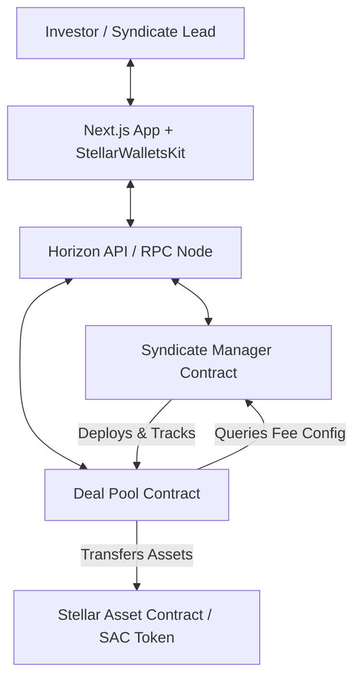
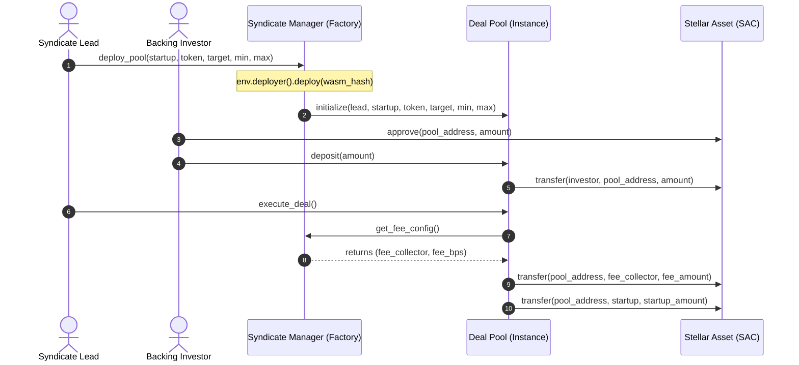
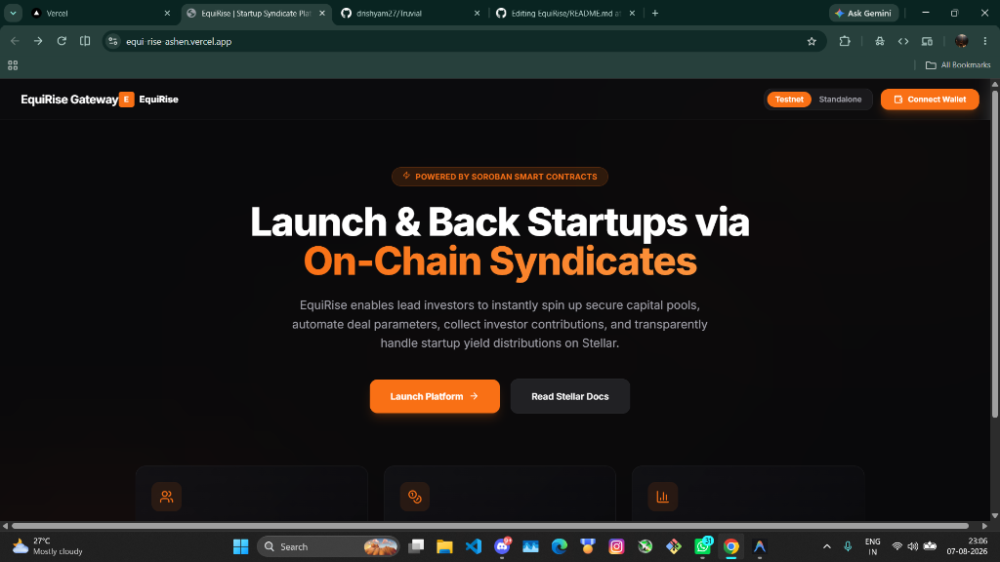

<h1 align="center">EquiRise Startup Investment Syndicate</h1>

<p align="center">
  <strong>A Decentralized, Milestone & Pro-Rata Startup Investment Syndicate Platform built on the Stellar network using decoupled Soroban smart contracts.</strong>
</p>

<p align="center">
  <a href="https://equirise.vercel.app/" target="_blank">
    
  </a>
</p>

<p align="center">
  <a href="https://github.com/bishalsahax-alt/EquiRise/actions/workflows/ci.yml" target="_blank">
    
  </a>
</p>

<p align="center">
  <a href="#overview">Overview</a> •
  <a href="#tech-stack">Tech Stack</a> •
  <a href="#directory-structure">Directory Structure</a> •
  <a href="#architecture">Architecture</a> •
  <a href="#contract-design">Smart Contracts</a> •
  <a href="#development">Development</a> •
  <a href="#deployment-guide">Deployment Guide</a> •
  <a href="#verification">Verification</a> •
  <a href="#security">Security</a>
</p>

---

* **GitHub Repository:** [bishalsahax-alt/EquiRise](https://github.com/bishalsahax-alt/EquiRise)
* **Walkthrough Demo Video:**
* 

https://github.com/user-attachments/assets/8e9b0514-44d3-45d2-aa0c-50e18b463208


---

## Table of Contents

* [1. Product Overview & Problem Statement](#overview)
  * [The Problem](#the-problem)
  * [The EquiRise Solution](#the-equirise-solution)
* [2. Technical Stack](#tech-stack)
* [3. Directory Structure](#directory-structure)
* [4. Technical Architecture & Component Flow](#architecture)
  * [1. Decoupled Access Control & Factory Flow](#decoupled-flow)
  * [2. Inter-Contract Communication Sequence](#inter-contract-communication)
* [5. Smart Contract Design](#contract-design)
  * [1. Syndicate Manager (Factory Contract)](#syndicate-manager)
  * [2. Deal Pool (Escrow & Execution Contract)](#deal-pool)
  * [3. Data Storage & TTL Preservation](#storage-design)
  * [4. Access Control & Security](#access-control)
* [6. Local Development & Testing](#development)
  * [Prerequisites](#prerequisites)
  * [Compilation & Testing](#compilation-testing)
  * [Frontend Development](#frontend-dev)
* [7. Stellar Testnet Deployment Guide](#deployment-guide)
  * [Step 1: Configure Deployer Identity](#deployer-identity)
  * [Step 2: Compile WASM Bytecodes](#compile-wasm)
  * [Step 3: Deploy Syndicate Manager](#deploy-manager)
  * [Step 4: Deploy Deal Pool WASM & Register](#deploy-pool-wasm)
  * [Step 5: Initialize Contracts & Configure Platform](#initialize-contracts)
* [8. Deployed Contract Verification](#verification)
  * [On-Chain Contract Verification Links](#verification-links)
* [9. Security Considerations](#security)
* [10. Project Media & Screenshots](#screenshots)

---

<a name="overview"></a>
## 1. Product Overview & Problem Statement

### The Problem
Traditional venture capital and angel syndicates suffer from opacity, high administrative overhead, manual cap table calculations, and fragmented escrow arrangements. Lead investors expend significant time manually collecting funds, tracking deposits across multiple off-chain bank accounts, and executing distribution payouts. Backing community investors are left with limited real-time visibility into capital pooling progress, deal execution milestones, and proportional ROI distributions.

### The EquiRise Solution
EquiRise resolves these structural limitations on the Stellar blockchain using:
* **Decoupled Syndicate Manager (Factory)**: Lead investors spin up dedicated `Deal Pool` instances on-demand while global platform rules, fee structures, and whitelists remain centralized in a governed `Syndicate Manager` contract.
* **Non-Custodial Capital Escrow**: Backed community investors deposit assets (such as USDC) directly into automated smart contract pools with enforced investment bounds (min/max deposits) and automatic milestone tracking.
* **Pro-Rata ROI & Fee Distribution**: When a deal is executed or returns are generated, the smart contract automatically calculates pro-rata payouts for all syndicate participants and deducts platform fees seamlessly before disbursing funds to startups.

---

<a name="tech-stack"></a>
## 2. Technical Stack

* **Smart Contracts:** Rust, Soroban SDK (pinned to `v22.0.1` for maximum environment compatibility)
* **Frontend:** Next.js 15 (App Router), React 19, TypeScript, Tailwind CSS, Lucide Icons
* **State Management:** Zustand (wallet session persistence, transaction logs, active syndicate tracking)
* **Data Querying:** React Query (RPC state status synchronization)
* **Wallet Connection:** `@creit.tech/stellar-wallets-kit` SDK (Freighter / xBull / LOBSTR / Hana)
* **Testing & Quality Assurance:** Vitest, React Testing Library, Cargo Unit Testing Suite
* **Web3 Design Aesthetics:** Premium dark-mode aesthetic with custom neon accents, status badges, dynamic stats counters, modal dialogs, and responsive layout.

---

<a name="directory-structure"></a>
## 3. Directory Structure

The project is organized with a feature-based modular architecture separating smart contracts, deployment scripts, and the Next.js web application:

```
EquiRise/
├── .github/
│   └── workflows/
│       └── ci.yml                     # CI/CD Pipeline Configuration
├── contracts/
│   ├── Cargo.toml                     # Workspace Cargo configuration
│   ├── syndicate_manager/             # Syndicate Manager (Factory & Access Control)
│   │   ├── Cargo.toml
│   │   └── src/
│   │       ├── lib.rs                 # Factory logic, RBAC, fee governance
│   │       └── tests.rs               # Unit tests for factory contract
│   └── deal_pool/                     # Deal Pool (Escrow & Pro-Rata Distribution)
│       ├── Cargo.toml
│       └── src/
│           ├── lib.rs                 # Escrow pooling, state machine, payouts
│           └── tests.rs               # Unit tests for deal pool contract
├── frontend/
│   ├── src/
│   │   ├── app/                       # Next.js App Router pages (Dashboard, Deals, Analytics)
│   │   ├── components/                # UI components (Navbar, Modals, Cards, Badges)
│   │   ├── services/                  # Stellar SDK & RPC integration layer
│   │   ├── state/                     # Zustand global state stores
│   │   └── tests/                     # Vitest component & integration tests
│   ├── package.json
│   └── vitest.config.ts
├── scripts/
│   ├── setup_testnet.ts               # Deployer account creation & Friendbot funding
│   └── deploy.ts                      # Soroban contract compilation & testnet deployment
├── .env.example                       # Environment variable templates
├── package.json                       # Root script execution configuration
├── tsconfig.json                      # TypeScript configuration
└── README.md                          # Project Documentation
```

---

<a name="architecture"></a>
## 4. Technical Architecture & Component Flow

<a name="decoupled-flow"></a>
### 1. Decoupled Access Control & Factory Flow


```mermaid
graph TD
    User[Investor / Syndicate Lead] <--> Frontend[Next.js App + StellarWalletsKit]
    Frontend <--> Horizon[Horizon API / RPC Node]
    Horizon <--> Manager[Syndicate Manager Contract]
    Horizon <--> Pool[Deal Pool Contract]
    
    Manager -- Deploys & Tracks --> Pool
    Pool -- Queries Fee Config --> Manager
    Pool -- Transfers Assets --> Token[Stellar Asset Contract / SAC Token]
```

<a name="inter-contract-communication"></a>
### 2. Inter-Contract Communication Sequence


```mermaid
sequenceDiagram
    autonumber
    actor Lead as Syndicate Lead
    actor Investor as Backing Investor
    participant Manager as Syndicate Manager (Factory)
    participant Pool as Deal Pool (Instance)
    participant Token as Stellar Asset (SAC)

    Lead->>Manager: deploy_pool(startup, token, target, min, max)
    Note over Manager: env.deployer().deploy(wasm_hash)
    Manager->>Pool: initialize(lead, startup, token, target, min, max)
    
    Investor->>Token: approve(pool_address, amount)
    Investor->>Pool: deposit(amount)
    Pool->>Token: transfer(investor, pool_address, amount)
    
    Lead->>Pool: execute_deal()
    Pool->>Manager: get_fee_config()
    Manager-->>Pool: returns (fee_collector, fee_bps)
    Pool->>Token: transfer(pool_address, fee_collector, fee_amount)
    Pool->>Token: transfer(pool_address, startup, startup_amount)
```

---

<a name="contract-design"></a>
## 5. Smart Contract Design

EquiRise utilizes two core smart contracts compiled to WebAssembly and executed on Stellar's Soroban VM:

<a name="syndicate-manager"></a>
### 1. Syndicate Manager (Factory Contract)
- **Dynamic Instance Deployment**: Deploys new `Deal Pool` instances using `env.deployer().with_current_contract(salt).deploy(wasm_hash)`.
- **Role-Based Access Control (RBAC)**: Enforces authorized lead investor verification and admin privileges.
- **Platform Fee Governance**: Stores and returns global fee configurations (`fee_collector`, `fee_bps`).

<a name="deal-pool"></a>
### 2. Deal Pool (Escrow & Execution Contract)
- **State Machine Management**: Transitions through lifecycle phases: `Active` ➔ `Funded` / `Closed` ➔ `Distributed`.
- **Capital Bounds**: Validates individual deposit parameters (`min_deposit`, `max_deposit`) and checks total pooled funds against `target_amount`.
- **Pro-Rata Payout Calculation**: Calculates exact share ratios for backing investors during ROI returns distribution without rounding discrepancies.

<a name="storage-design"></a>
### 3. Data Storage & TTL Preservation
- Uses Soroban Instance and Persistent storage types strategically to optimize gas overhead.
- Implements `extend_ttl` calls to ensure contract state and balance tracking keys remain active on-chain.

<a name="access-control"></a>
### 4. Access Control & Security
- Sensitive actions (e.g. executing deals, cancelling pools, updating fee configs) require explicit `.require_auth()` signature verification.
- Upgrades are governed by the Syndicate Manager admin through secure `upgrade` functions.

---

<a name="development"></a>
## 6. Local Development & Testing

<a name="prerequisites"></a>
### Prerequisites
* **Rust**: `v1.75.0` or higher with target `wasm32-unknown-unknown`
* **Node.js**: `v18.0.0` or higher
* **Stellar CLI / Soroban CLI**: Installed locally

<a name="compilation-testing"></a>
### Compilation & Testing

```bash
# Navigate to contracts directory
cd contracts

# Run unit tests across all contracts
cargo test

# Build optimized WASM binaries for target deployment
cargo build --target wasm32-unknown-unknown --release
```

<a name="frontend-dev"></a>
### Frontend Development

```bash
# Navigate to frontend directory
cd frontend

# Install dependencies
npm install

# Run Next.js local development server
npm run dev

# Run Vitest test suite
npm run test
```

Open [http://localhost:3000](http://localhost:3000) in your browser to interact with the dApp UI.

---

<a name="deployment-guide"></a>
## 7. Stellar Testnet Deployment Guide

<a name="deployer-identity"></a>
### Step 1: Configure Deployer Identity
Generate or set your deployer secret key in `.env`:

```bash
cp .env.example .env
```

<a name="compile-wasm"></a>
### Step 2: Compile WASM Bytecodes
Compile the release WASM binaries for `syndicate_manager` and `deal_pool`:

```bash
cd contracts
cargo build --target wasm32-unknown-unknown --release
cd ..
```

<a name="deploy-manager"></a>
### Step 3: Deploy Syndicate Manager
Run the automated testnet setup script to request Friendbot funding and deploy contracts:

```bash
# Fund deployer account via Friendbot
npm run setup:testnet
```

<a name="deploy-pool-wasm"></a>
### Step 4: Deploy Deal Pool WASM & Register
Deploy the contract to Stellar testnet and register the WASM hash:

```bash
# Deploy Syndicate Manager & register Deal Pool WASM Hash
npm run deploy:testnet
```

<a name="initialize-contracts"></a>
### Step 5: Initialize Contracts & Configure Platform
The deployment script automatically updates `.env` with the deployed `NEXT_PUBLIC_SYNDICATE_MANAGER_ADDRESS` and `NEXT_PUBLIC_DEAL_POOL_WASM_HASH`.

---

<a name="verification"></a>
## 8. Deployed Contract Verification

<a name="verification-links"></a>
### On-Chain Contract Verification Links

| Contract / Asset | Target Network | Deployed Address / Hash | Explorer Link |
| :--- | :--- | :--- | :--- |
| **Syndicate Manager** | Stellar Testnet | `CBF3DCZXOLOQLTNKVY4UPCC5KTTANOIT3KV3CKS7GKJI3SHX5JPFGM6M` | [View on Stellar Expert](https://stellar.expert/explorer/testnet/contract/CBF3DCZXOLOQLTNKVY4UPCC5KTTANOIT3KV3CKS7GKJI3SHX5JPFGM6M) |
| **Mock USDC Token** | Stellar Testnet | `CBIELTK6YBZJU5UP2WWQEUCYKLPU6AUNZ2BQ4WWFEIE3USCIHMXQDAMA` | [View Asset Details](https://stellar.expert/explorer/testnet/contract/CBIELTK6YBZJU5UP2WWQEUCYKLPU6AUNZ2BQ4WWFEIE3USCIHMXQDAMA) |

---

<a name="security"></a>
## 9. Security Considerations

1. **Reentrancy Protection**: State updates precede asset transfers across all execution logic to mitigate reentrancy risks.
2. **Strict Authentication Checks**: Investor deposits, lead executions, and admin administrative updates enforce strict `.require_auth()` verification.
3. **Bounded Deposit Thresholds**: Minimum and maximum deposit caps prevent target overflow and protect small-ticket investors.
4. **Governed Upgradability**: Contract upgrades require cryptographic authorization from the designated admin address.

---

<a name="screenshots"></a>
## 10. Project Media & Screenshots

### 1. Desktop View
High-resolution desktop interface showcasing the EquiRise Gateway platform hero view, Soroban Smart Contract integration badge, network mode switcher (Testnet / Standalone), and wallet connection gateway.



---

### 2. Mobile Responsive View
Fluid, responsive mobile layout optimized for mobile screens. Features touch-friendly navigation, mobile network switcher (Testnet / Standalone), instant action buttons, and wallet connection controls.


---

### 3. Multi-Wallet Integration
Native Web3 modal support connecting to leading Stellar wallet extensions (`Freighter`, `xBull`, `LOBSTR`, `Hana`) via `@creit.tech/stellar-wallets-kit`.


---

### 4. Deployed Testnet Transaction
On-chain transaction execution verified on Stellar Expert Testnet Explorer (`CBF3DCZXOLOQLTNKVY4UPCC5KTTANOIT3KV3CKS7GKJI3SHX5JPFGM6M`), displaying Soroban contract invocation details and USDC asset movements.


---

### 5. CI/CD Pipeline
Automated GitHub Actions workflow (`.github/workflows/ci.yml`) validating Rust Cargo unit tests, Soroban WASM contract compilation, Vitest suite execution, and Next.js production builds.


---

### 6. Test Output
Terminal execution suite output demonstrating clean passing results across Cargo smart contract unit tests, Vitest component/integration tests, and production build checks.


---
